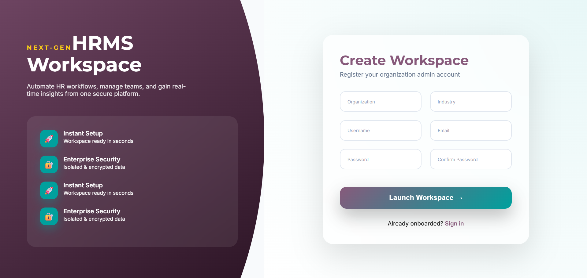
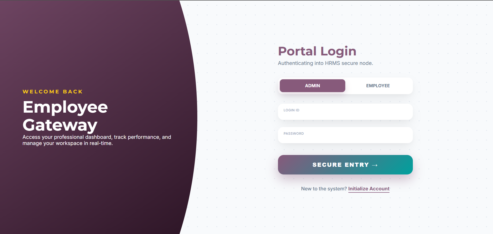
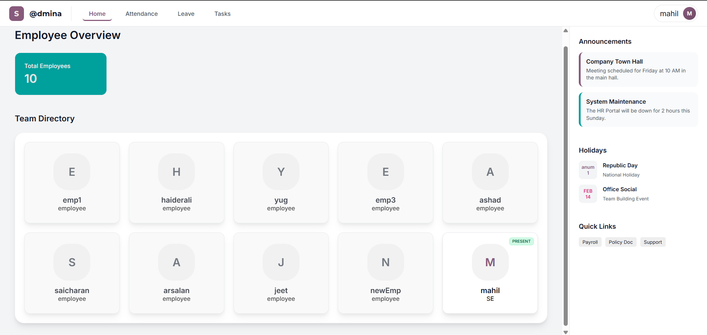
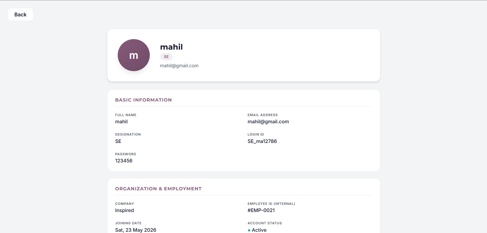

# 🚀 Human Resource Management System (HRMS)

A robust and intuitive **Human Resource Management System (HRMS)** designed to streamline workplace productivity. This platform empowers administrators to manage employees, track attendance, assign tasks, handle leave requests, and monitor GitHub project submissions all from a centralized dashboard.

---

## 📸 Screenshots

<table width="100%">
  <tr>
    <td width="50%" align="center">
      <h3>Admin Dashboard</h3>
      
    </td>
    <td width="50%" align="center">
      <h3>Employee Management</h3>
      
    </td>
  </tr>
  <tr>
    <td width="50%" align="center">
      <h3>Attendance Tracker</h3>
      
    </td>
    <td width="50%" align="center">
      <h3>Task Assignment</h3>
      
    </td>
  </tr>
  <tr>
    <td width="50%" align="center">
      <h3>Leave Management</h3>
      
    </td>
    
  </tr>
</table>

---

## ✨ Key Features

### 👑 Admin Capabilities
*   **Centralized Employee Management:** Add, update, suspend, or view detailed profiles of all employees.
*   **Smart Attendance Tracking:** Monitor daily clock-in/clock-out times, total hours worked, and monthly attendance reports.
*   **Task Assignment & Monitoring:** Delegate tasks to specific employees with deadlines, priorities, and live status tracking.
*   **Leave Management System:** Review, approve, or reject employee leave applications with automated status updates.
*   **GitHub Submission Review:** Track developer code contributions by reviewing repository links and submission logs directly.

### 👤 Employee Capabilities
*   Mark daily attendance.
*   View assigned tasks and update project statuses.
*   Apply for leaves and track approval history.
*   Submit GitHub repository links for project reviews.

---

## 🛠️ Tech Stack

*   **Frontend:** HTML5, CSS3, JavaScript
*   **Backend:** Node.js / Express
*   **Database:** MongoDB / MySQL
*   **Version Control:** Git & GitHub

---

## 📂 Project Structure

To ensure the images display correctly in the table above, place your PNG files in the `screenshots/` directory matching these exact filenames:
